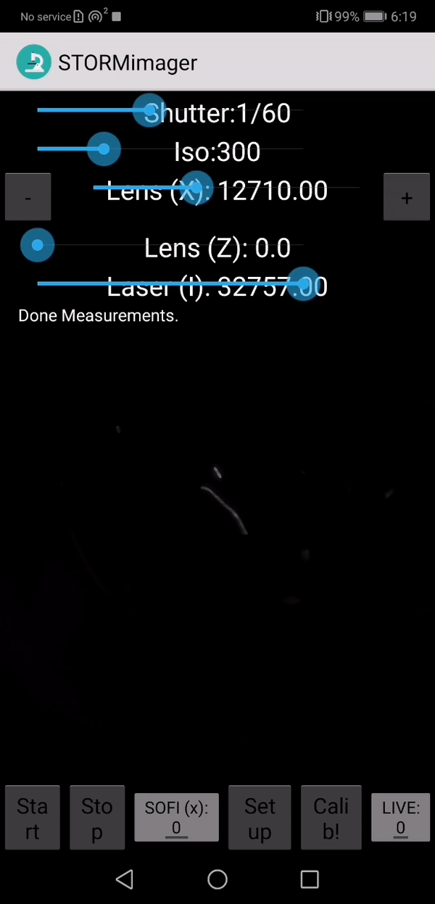

# *cell*STORM II

A low-cost super-resolution imaging device based on a cellphone camera and photonic waveguide chips

You can find more information on our [project webpage](https://beniroquai.github.io/stormocheap/)


The APP features:

```
- autofocus
- automatic coupling mechanism
- on-device superresolution imaging using Tensorflow Lite
- Long-term time-lapse imaging 
- MQTT-based control of external devices (e.g. laser, lenses)
```


---

## Preprint 

The preprint for the *cell*STORM II device accompanied with a series of applications ca be found on [**BIORXIV**](https://www.biorxiv.org/content/10.1101/2020.09.04.283085v1) 😊 

## Setup 

Setting up the microscope is straightforward, but requires some technical experience! The basic idea is to have a WiFi-based network, which connects all different components with each other. This can be the cellphone where the APP "STORMImager" is running on and external components such as Lasers, LEDs, etc. WiFi-capable microcontrollers, such as ESP32s bridge the gap between WiFi and I2C or other interfaces. 

The communication protocol is MQTT an IP-based protocol layer which simplifies live a lot! 

***HINT:*** we advise you to have a look at our much more comprehensive tutorial in the [UC2 Software Repo](https://github.com/bionanoimaging/UC2-Software-GIT/blob/eb0781d328b5058a664b39e5b38b3c1f79d91cc1/GUI/RASPBERRY_PI/README.md)

***1. Install MQTT on the Pi***

(We assume you have a running Raspbian on your Raspi; Following commands should be carried out through SSH) 
If you decided to use the MQTT (WiFi-based) service to connect to your Micro-Controller (ESP32 -> for hardware like LED, motor etc) then you need to install the mosquitto server. For now, we will only setup a non-secured connection as we assume, that your WiFi is anyways local and non-public as well as uses WPA2. In a terminal, run: 

```
$   sudo apt-get install mosquitto mosquitto-clients
``` 

The service will automatically start and is running. Nice! 

***2. Setup static IP and WiFi on Pi***

Enter ```sudo nano /etc/dhcpcd.conf```

Add: 
```
interface wlan0
static ip_address=192.168.43.88
static routers=192.168.43.1
```

***HINT:*** Android Hotspots have an IP-Range ```192.168.43.XXX```


Setting up the Wifi:

```sudo nano /etc/wpa_supplicant/wpa_supplicant.conf```

Go to the bottom of the file and add the following:

```
network={
    ssid="Blynk"
    psk="12345678"
}
```


Restart the Pi 

```sudo reboot```

***3. Setup Android WiFi Hotspot***

Modern Android phones allow the creation of Wifi hotspots. Open Settings and add under Wifi-Settings the following settings (it can be the device which is used for the APP STORMImager).

```
SSID: Blynk
Password: 12345678
```

(***HINT:*** This is historically ;-)..

The Raspberry pi with the Mosquito server as well as the ESP32 clients will automatically connect to it.

***4. Debugging in Mosquitto***
If you have chosen to use an external MQTT-broker you can use this for debugging the commands. Password of our broker is "password", username is pi.
To read out the topics which are sent through the network, type

	mosquitto_sub -d -u username -P pi -t test
	mosquitto_sub -v -h 192.168.43.88 -p 1883 -t '#' -P pi -u username

where the IP is gathered by finding the raspberry pis IP adress by typing

	ifconfig


***5. Setup ESP32***

Have an in-detail look for the instructions [here](https://github.com/beniroquai/dSTORM-on-a-Chi-ea-p/tree/master/ELECTRONICS) and please report an issue if something is unclear (very likely!). 

*Basics:*
 
- Download code [here](https://github.com/beniroquai/dSTORM-on-a-Chi-ea-p/blob/master/ELECTRONICS/ESP32/ESP32_MQTT_LENS-X-Z_LED_Array_JENA/ESP32_MQTT_LENS-X-Z_LED_Array_JENA.ino)
- Hook-up the ESP32 to the Arduino environment and flash it 
- Open the serial command line and observe the output. The ESP32 should automatically connect to the Blynk-wifi and then to the MQTT if everything is setup correctly
- It says ```Connecting to wifi....``` and after a while: ```Connected to Blynk```
- Then it looks for the MQTT Broker and says ```MQTT connected```

***6. Connecting the APP to the network***

Open the **STORMImager APP** and hit the button ```Start Measurement```

***ATTENTION:*** In case you don't see the camera stream yet: hit the "back" button on the Android phone and press the button ```Start Measurement```again

Hit the button ```Setup```and enter the IP address of your Raspberry Pi (e.g. ```192.143.43.88```). 

The following settings represent:

- **SOFI (X):** Amplitude of lens oscillation in x-direction at a fixed frequency (e.g. 20/15**2
- **SOFI (Z):** Amplitude of lens oscillation in z-direction at a fixed frequency (e.g. 20/15**2
- **SOFI (X)/SOFI (Z):** can be turned on with the button which enable it during long-term measruements
- **Periodicity:** Gives the time between measurements
- **Duration:** Gives the time for the whole experiment 
- **Realign:** When should the system start realigning? (Autofocus/Auto lens alignment)

Hit the **Set** button to save settings. 

The app should say ```Connected```

***7. Starting an experiment***

The button **Live** can be checked to start the super-resolution using the pretrained network (see next section).

The button **Focus!** can be used to perform an autofocus.

The button **Calib!** can be used to perform an autoalignment of the coupling lens.

The button **SOFI(x)!** can be checked to start SOFI on the microscope.

The buttons **START/STOP** start and stop the experiment. 

The slider **Shutter** controls the cameras exposure time.

The slider **ISO** controls the cameras ISO/gain.

The slider **Lens (x)** controls the position of the coupling lens in x-direction.
 
The slider **Lens (z)** controls the position of the coupling lens in z-direction.

The slider **Laser (I)** controls the intensity of the coupling laser.


### Step-by-step guide to hook-up the components

### Autofocus inside the APP:

It's just an example how the cellphone maintains the focus. This is done by maximizing the focus metric (i.e. standard deviation over z) as a function of the focus motor position.

<p align="center">

</p>


### SOFI-based superresolution imaging inside the APP:

This is an example of the SOFI-based superresolution imaging using the neural network mentioned below. We used fixed *e.coli* labelled with ATTO 647.
The fluctuation of the illumination is the result of the discrete mode pattern in the singlemode waveguide chip. The input field changes the intensity pattern.   

<p align="center">

</p>

# Contribute

If you have a question or found an error, please file an issue! We are happy to improve the device!  

# License

Please have a look into the dedicated [License file](LICENSE.MD).

# Disclaimer

We do not give any guarantee for the proposed setup. Please use it at your own risk. Keep in mind that Laser source can be very harmful to your eye and your environemnt!

